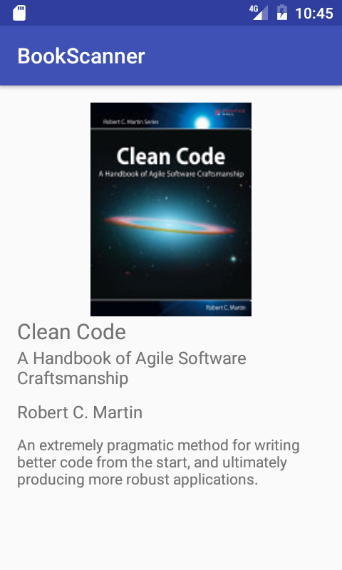

Zadanie BookScanner
===================
Przepraszam za opóźnienie. Miłej zabawy!

* Załóż konto na github.
* Utwórz fork tego projektu na swoim koncie (opcjonalne).
* Zaimportuj projekt to AS lub sciągnij jako zip.
* Dodaj brakujący permission w AndroidManifest.xml.
* Uzupełnij BookApi tak, aby metoda getBook wykonywała zapynie pod następujący adress:
```
https://www.googleapis.com/books/v1/volumes?q=isbn:9780132350884
```
* Utwórz BookDetailsActivity i zbuduj layout przypominający poniższy obrazek. Zawierający: ImageView (okładka książki) i 4 TextView (Tytuł, Podtytuł, Autor, Opis).



* Odkomentuj kod startujący nowe activity i wysyłający jako parametr VolumenInfo i wyświetl go na BookDetailsActivity. Przesłany obiekt otrzymasz wołając w onCreate():

```java
VolumeInfo volumeInfo = (VolumeInfo) getIntent().getSerializableExtra(BookScannerActivity.VOLUME_INFO_EXTRA);
```

* Ładowanie obrazków otrzymasz dzięki:

```java
Picasso.with(this)
    .load(volumeInfo.getImageLinks().getThumbnail())
    .into(coverImageView);
```

* Dodaj zapamiętywanie zeskanowanych elementów na liście. Użyj ArrayAdapter<VolumeInfo> z layoutem android.R.layout.simple\_list\_item\_1.


